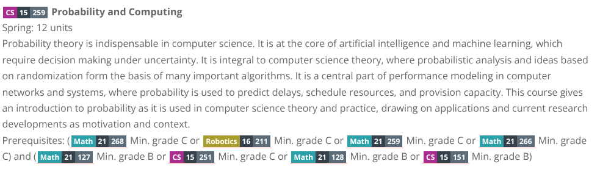

# CMU Course Labels

A userscript that renders CMU course codes as labelled badges on CMU websites.

You need to have a [**userscript manager**](https://github.com/awesome-scripts/awesome-userscripts#compatibility) to install this script.

| [Install](https://github.com/q1zhen/cmu-course-labels/raw/refs/heads/main/main.user.js) |
|-|

When a course code appears on a page (either as `xx-xxx` or `xxxxx`) the script replaces it with a badge with the department name (hover for full name) and makes it a link to that course in the course catalogue.